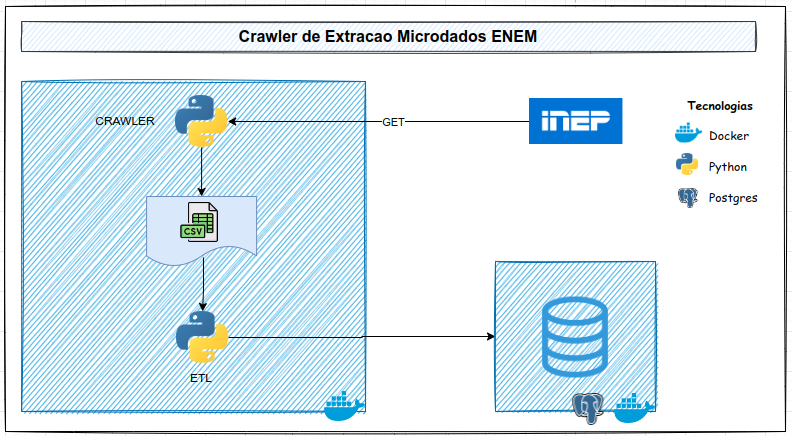

# Criacao de um Crawler para extracao dos Microdados ENEM 2020

Projeto pratico com a criacao de um crawler para extrair os microdados do ENEM 2020 diretamente do site do INEP desenvolvido como atividade avaliativa do Bootcamp Engenheiro de Dados da XPEducacao.

Visando tornar o projeto compativel com o conceito de **Bancos de Dados Evolutivos**, utiliza-se as bibliotecas `alembic` e `sqlalchemy` para o deploy automatico e controle de versionamento do modelo fisico do banco de dados.

Utiliza-se como SGBD padrao o Banco de Dados `Postgresql`.

Alem disso, para tornar ainda melhor a compatibilidade e simplificar o deploy utiliza-se a tecnologia de containers por meio do `Docker` e `Docker Compose`.

## **Modelo Fisico** 


## **Arquitetura do Projeto** 


## Ambiente de Desenvolvimento
- [Docker 20.10.17](https://docs.docker.com/engine/install/ubuntu/)
- [Docker Compose 1.26.0](https://docs.docker.com/compose/install/)

Execute o comando a seguir na raiz do projeto para build das imagens
```bash
$ docker-compose build
```

Execute o comando a seguir para subir o banco de dados e realizar uma carga do crawler
```bash
$ docker-compose up -d
```

## SSL
Para que seja possivel extrair os dados do site do inep e necessario apontar os certificados referentes ao dominio onde os dados serao requisitados.

Todos os certificados devem ser copiados para o arquivo `cert_inep.pem`.

## Referencias
- [Dask DataFrame](https://docs.dask.org/en/stable/)
- [Pandas](https://pandas.pydata.org/docs/user_guide/index.html)
- [Alembic](https://alembic.sqlalchemy.org/en/latest/)
- [SqlAlchemy](https://docs.sqlalchemy.org/en/14/)